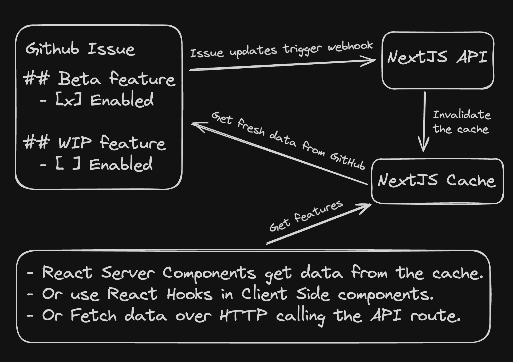

# 🏁 next-flag

Feature flags powered by GitHub issues and NextJS. Toggle the features of your app without deploying a new version by ticking a checkbox in the body of a GitHub issue.

## ✨ Features

- [x] Enable or disable features by ticking a checkbox in a GitHub issue.
- [x] Define feature flags across multiple environments or branches.
- [x] Supports React Server Side and Client Side Components. Powered by the NextJS Cache.
- [x] Can be deployed as a stand-alone service to manage feature flags for multiple NextJS apps.

> Check-out a fully working [NextJS example](./examples/nextjs-example/) or jump to [Getting started](https://github.com/TimMikeladze/next-flag?tab=readme-ov-file#-getting-started).

## 📡 Install

```console
npm install next-flag

yarn add next-flag

pnpm add next-flag
```

> 👋 Hello there! Follow me [@linesofcode](https://twitter.com/linesofcode) or visit [linesofcode.dev](https://linesofcode.dev) for more cool projects like this one.

## 🛠️ Architecture



## 🎥 Demo

https://github.com/TimMikeladze/next-flag/assets/702718/d1707ae0-f9cf-4f80-a20f-6a6f9f715dc2

## 🚀 Getting started

### 📄 Create a new issue

First, create a new issue in your repository with the following format. It is optional to include a list of environments that the feature should be enabled in.

```markdown
# 🏁 Feature Flags

## WIP feature

- [x] Enabled

## New feature

- [x] Enabled

### Production

- [ ] Enabled

### Preview

- [ ] Enabled

### Development

- [ ] Enabled
```

### 🐙 Setup GitHub

Now let's get an auth token from GitHub and create a Webhook.

1. [Create a new personal access token](https://github.com/settings/tokens?type=beta) in GitHub with **Read access to issues and metadata**.
2. Create a GitHub Webhook by navigating to `https://github.com/<OWNER>/<REPO>/settings/hooks/new`
   - Set the **Payload URL** to `https://<YOUR_DOMAIN>/api/next-flag`. Hint: Use [ngrok](https://ngrok.com/) for local development.
   - Set the **Content type** to `application/json`
   - Set the **Secret** to a random string
   - Select the **Issues** event.
3. Add the GitHub token and webhook secret to the `.env` file of your NextJS app.

```bash
NEXT_FLAG_GITHUB_TOKEN=""
NEXT_FLAG_WEBHOOK_SECRET=""
```

### 💻 Configure your NextJS app

Finally, let's write some code to use the `next-flag` package.

```ts
// src/app/api/next-flag/index.ts
import { NextFlag } from 'next-flag';
import { revalidateTag, unstable_cache } from 'next/cache';

export const nf = new NextFlag({
  paths: [
    {
      repository: '<OWNER>/<REPO>',
      issue: 123,
    },
  ],
  cache: {
    revalidateTag,
    unstable_cache,
  },
});
```

Next, create a new API route to handle the incoming Webhook requests.

```ts
// src/app/api/next-flag/route.ts
import { NextRequest } from 'next/server';

import { nf } from '.';

export const POST = (req: NextRequest) => nf.POST(req);

export const GET = (req: NextRequest) => nf.GET(req);
```

You can now use the `nf` instance to check if a feature is enabled in your app.

This can be done in a React Server Component:

```ts
// src/app/page.tsx
'use server';

import { nf } from './api/next-flag';

export default async function Page() {
  const wipFeatureEnabled = await nf.isFeatureEnabled('wip-feature');

  return wipFeatureEnabled && <div>WIP feature enabled!</div>;
}
```

Or in a React Client Component:

```tsx
// src/app/components/Feature.tsx
'use client';

import { useNextFlag } from 'next-flag/react';

export const Feature = () => {
  const nf = useNextFlag();

  if (nf.loading) {
    return null;
  }

  const wipFeatureEnabled = nf.isFeatureEnabled('wip-feature');

  return wipFeatureEnabled && <div>WIP feature enabled!</div>;
};
```

You can also wrap your client side app with the `NextFlagProvider` to fetch features once on mount and provide them to child components when using the `useNextFlag` hook.

```tsx
// src/app/components/Feature.tsx
'use client';

import { NextFlagProvider, useNextFlag } from 'next-flag/react';

const ContextProvider = () => {
  return (
    <NextFlagProvider>
      <Component />
    </NextFlagProvider>
  );
};

const Component = () => {
  const nf = useNextFlag();
  const gettingStarted = nf.isFeatureEnabled('getting-started');
  return (
    <>
      {gettingStarted && (
        <p>
          Get started by editing&nbsp;
          <code className={styles.code}>src/app/page.tsx</code>
        </p>
      )}
    </>
  );
};
```

## 💪 Advanced Usage

### 🏝️ Multiple environments or branches

By default `next-flag` will try to read `process.env.NEXT_PUBLIC_VERCEL_ENV || process.env.NEXT_PUBLIC_ENV || process.env.NEXT_PUBLIC_STAGE || process.env.VERCEL_ENV || process.env.ENV || process.env.STAGE || process.env.NODE_ENV` to determine the current environment.

You can customize how the current environment is determined during runtime by passing a `getEnvironment` function to the `NextFlag` constructor.

To associate a feature with a specific environment, add a subheading to the feature issue with the name of the environment (case-insensitive).

- When using multiple environments, the top-level feature flag will control whether the feature is enabled or disabled.
- If the top-level feature flag is disabled, the feature will be disabled in all environments.
- If the top-level feature flag is enabled, then the environment-specific flags will determine whether the feature is enabled.

```markdown
# 🏁 Feature Flags

## My feature

- [x] Enabled

### Production

- [ ] Enabled

### Preview

- [ ] Enabled

### Development

- [ ] Enabled
```

### ✅ Getting all features

You can always get all features by calling the `getFeatures` method. You can also open the `/api/next-flag` route in your browser to see the enabled features as a JSON array.

```ts
import { nf } from './api/next-flag';
import { getFeatures, isFeatureEnabled } from 'next-flag/client';

// server side
const features = await nf.getFeatures();
// or client side with an HTTP request
const features = await getFeatures();
// check if a feature is enabled
const wipFeatureEnabled = await isFeatureEnabled('wip-feature');
```

### 📦 Deploying a stand-alone next-flag server

You can deploy the `next-flag` server as a separate NextJS app and use it as a feature flagging service for multiple NextJS apps.

1. Follow the steps above to setup GitHub and create a new NextJS app.
2. When initializing the `NextFlag` instance, pass multiple projects to the `paths` option and set `standalone` to `true`.
3. Deploy this NextJS app somewhere...
4. In a different NextJS app:
   1. Configure the `.env` file with a `NEXT_PUBLIC_NEXT_FLAG_PROJECT` and `NEXT_PUBLIC_NEXT_FLAG_ENDPOINT`.
   2. Use `isFeatureEnabled` from the `next-flag/client` package to check if a feature is enabled in a React Server Component.
   3. Use the `useNextFlag` hook from the `next-flag/react` package to check if a feature is enabled in a React Client Component.

```bash
NEXT_PUBLIC_NEXT_FLAG_PROJECT="project-1"
NEXT_PUBLIC_NEXT_FLAG_ENDPOINT="https://<YOUR_DOMAIN>/api/next-flag"
```

```ts
// src/app/api/next-flag/index.ts
import { NextFlag } from 'next-flag';
import { revalidateTag, unstable_cache } from 'next/cache';

export const nf = new NextFlag({
  standalone: true,
  paths: [
    {
      project: 'project-1',
      repository: '<OWNER>/<REPO>',
      issue: 123,
    },
    {
      project: 'project-2',
      repository: '<OWNER>/<REPO>',
      issue: 124,
    },
  ],
  cache: {
    revalidateTag,
    unstable_cache,
  },
});
```

When running in stand-alone mode with multiple projects, you can pass the `project` option to the `isFeatureEnabled` method to check if a feature is enabled in a specific project.

You can pass an `environment` option to the `isFeatureEnabled` method to check if a feature is enabled in a specific environment.

These options will override the default values pulled from the environment variables.

```ts
import { isFeatureEnabled, getFeatures } from 'next-flag/client';

await isFeatureEnabled('wip-feature', {
  project: 'project-1',
  environment: 'development',
});
```

### ⛔️ Usage without a Webhook

Using a Github Webhook is optional, but highly recommended. The webhook is responsible for invalidating the NextJS Cache. Without this mechanism, caching of feature flags will be disabled and the feature flags will be fetched on every request.

If you don't want to use a Webhook simply omit the `NEXT_FLAG_WEBHOOK_SECRET` from the `.env` file.

## 📚 TSDoc

<!-- TSDOC_START -->

## :toolbox: Functions

- [getFeatures](#gear-getfeatures)
- [isFeatureEnabled](#gear-isfeatureenabled)
- [useNextFlag](#gear-usenextflag)
- [NextFlagProvider](#gear-nextflagprovider)

### :gear: getFeatures

| Function      | Type                                                |
| ------------- | --------------------------------------------------- |
| `getFeatures` | `(props?: GetFeaturesArgs) => Promise<GetFeatures>` |

### :gear: isFeatureEnabled

| Function           | Type                                                                                   |
| ------------------ | -------------------------------------------------------------------------------------- |
| `isFeatureEnabled` | `(feature: string or string[], options?: IsFeatureEnabledOptions) => Promise<boolean>` |

### :gear: useNextFlag

| Function      | Type                                                                                                                                                                    |
| ------------- | ----------------------------------------------------------------------------------------------------------------------------------------------------------------------- |
| `useNextFlag` | `(props?: UseNextFlagHookProps) => { loading: boolean; features: GetFeatures; error: Error or undefined; isFeatureEnabled: (feature: string or string[]) => boolean; }` |

### :gear: NextFlagProvider

| Function           | Type                                                |
| ------------------ | --------------------------------------------------- |
| `NextFlagProvider` | `(props: NextFlagProviderProps) => Element or null` |

## :wrench: Constants

- [NextFlagContext](#gear-nextflagcontext)

### :gear: NextFlagContext

| Constant          | Type                                |
| ----------------- | ----------------------------------- |
| `NextFlagContext` | `Context<GetFeatures or undefined>` |

## :factory: NextFlag

### Methods

- [GET](#gear-get)
- [isFeatureEnabled](#gear-isfeatureenabled)
- [getFeatures](#gear-getfeatures)
- [POST](#gear-post)

#### :gear: GET

| Method | Type                                                       |
| ------ | ---------------------------------------------------------- |
| `GET`  | `(req: NextRequest) => Promise<NextResponse<GetFeatures>>` |

#### :gear: isFeatureEnabled

| Method             | Type                                                                               |
| ------------------ | ---------------------------------------------------------------------------------- |
| `isFeatureEnabled` | `(feature: string or string[], project?: string or undefined) => Promise<boolean>` |

#### :gear: getFeatures

| Method        | Type                                                      |
| ------------- | --------------------------------------------------------- |
| `getFeatures` | `(project?: string or undefined) => Promise<GetFeatures>` |

#### :gear: POST

| Method | Type                                                                                                     |
| ------ | -------------------------------------------------------------------------------------------------------- |
| `POST` | `(req: NextRequest) => Promise<NextResponse<{ error: string; }> or NextResponse<{ success: boolean; }>>` |

<!-- TSDOC_END -->
